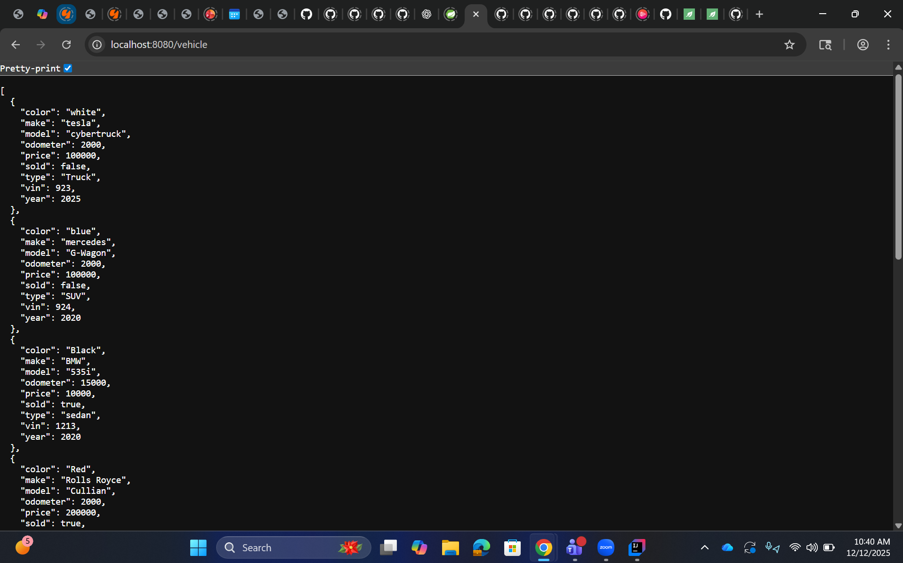
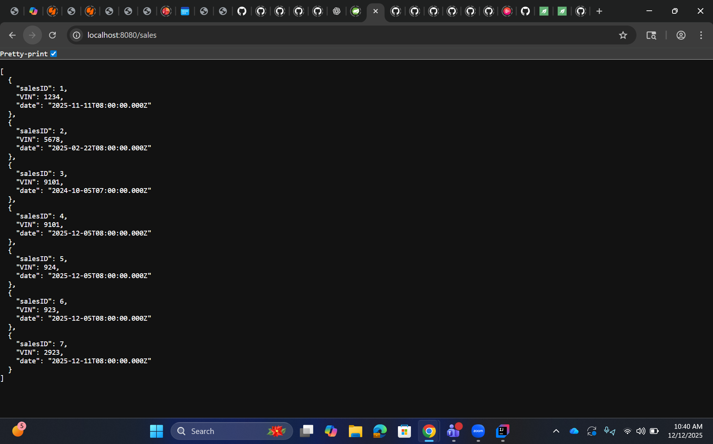
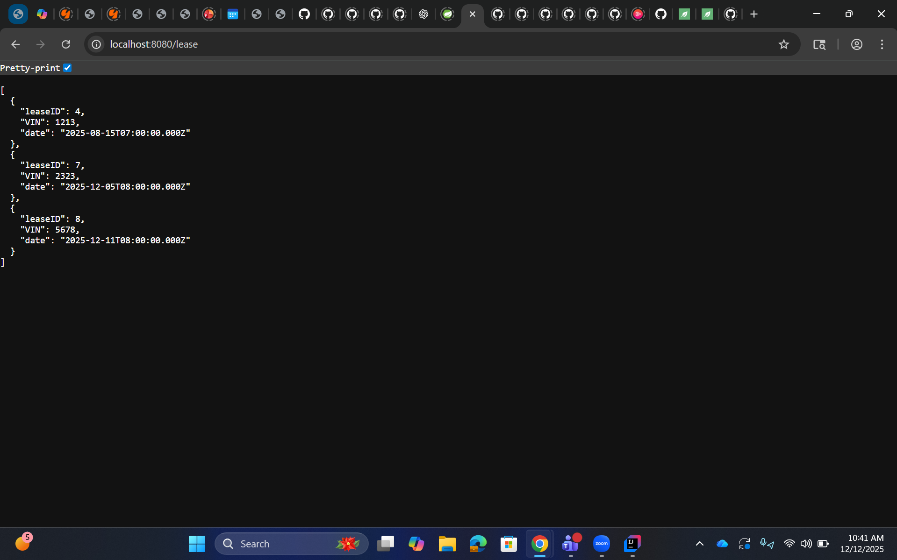
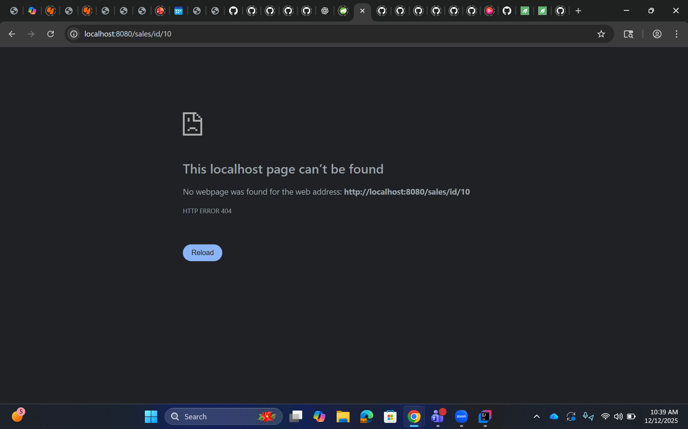

# 🚗 Car Dealership REST API (Spring Boot + MySQL)

The Car Dealership API is a fully RESTful Spring Boot application that manages vehicles, sales contracts, and lease contracts using a MySQL database.
This project replaces Workshop 5's file persistence and Workshop 8’s JDBC connection with real database CRUD operations using DAOs, services, and controllers.

## 📚 Table of Contents

- [Tech Stack](#tech-stack)
- [Project Structure](#project-structure)
- [Features](#features)
- [Database Schema](#database-schema)
- [REST Endpoints](#rest-endpoints)
- [Example JSON Requests](#example-json-requests)
- [Run Instructions](#run-instructions)
- [Interesting Code Snippet](#interesting-code-snippet)
- [Screenshots](#screenshots)
- [Author](#author)

---

## Tech Stack

- Java 17+

- Spring Boot 4

- MySQL 8+

- JDBC + Prepared Statements

- Apache Commons DBCP2

- Maven

- IntelliJ IDEA

---

## Project Structure
```
src/main/java
└── com.pluralsight.workshop9
├── controllers/
│   ├── VehicleController.java
│   ├── SalesContractController.java
│   └── LeaseContractController.java
├── service/
│   ├── VehicleService.java
│   ├── SalesContractService.java
│   └── LeaseContractService.java
├── daos/
│   ├── VehicleDao.java
│   ├── SalesContractDao.java
│   ├── LeaseContractDao.java
│   ├── VehicleDaoImpl.java
│   ├── SalesContractDaoImpl.java
│   └── LeaseContractDaoImpl.java
├── models/
│   ├── Vehicle.java
│   ├── SalesContract.java
│   └── LeaseContract.java
├── config/
└── DbConfig.java
```

---

## Features

✔ Vehicle CRUD

- Add vehicles

- Retrieve all vehicles

- Retrieve vehicle by VIN

- Delete vehicles

✔ Sales Contracts

- Add sales contract

- Get sales contract by ID

- View all sales contracts

✔ Lease Contracts

- Add lease contract

- Get lease contract by ID

- View all lease contracts

✔ Database Integration (JDBC)

- Prepared statements

- Connection pooling

- ResultSet → Model mapping

---

## Database Schema
Vehicles Table
```
VIN INT PRIMARY KEY
sold BOOLEAN
color VARCHAR(50)
make VARCHAR(50)
model VARCHAR(50)
price INT
year INT
mileage INT
type VARCHAR(50)
```

Sales Contracts Table
```
salesID INT PRIMARY KEY AUTO_INCREMENT
VIN INT
date DATE
```

Lease Contracts Table
```
leaseID INT PRIMARY KEY AUTO_INCREMENT
VIN INT
date DATE
```

---

## REST Endpoints
Vehicles
```
GET /vehicles

POST /vehicles

PUT /vehicles/{vin}

DELETE /vehicles/{vin}
```

Sales Contracts
```
GET /sales

GET /sales/id/{id}

POST /sales
```

Lease Contracts
```
GET /lease

GET /lease/id/{id}

POST /lease
```

---

## Example JSON Requests
POST /vehicles
```
{
"vin": 1923,
"sold": false,
"color": "Blue",
"make": "Range Rover",
"model": "4x4 Deluxe",
"price": 150000,
"year": 2023,
"mileage": 3000,
"type": "Truck"
}
```

GET /sales/id/7 Response Example
```
{
"salesID": 7,
"vin": 1923,
"date": "2025-12-10"
}
```

---

## Run Instructions
1. Configure MySQL

Import your SQL schema:
```
mysql -u root -p < cardealershipdatabase.sql
```

2. Update DB Credentials

application.properties:

```
datasource.url=jdbc:mysql://localhost:3306/cardealershipdatabase
datasource.username=root
datasource.password=yourpassword
```

3. Build & Run
```
   mvn clean install
   mvn spring-boot:run
```
---

## Interesting Code Snippet

```
//http://localhost:8080/sales/id/7
    @GetMapping("/id/{id}")
    public ResponseEntity<SalesContract> getSalesById(@PathVariable int id){
        SalesContract salesContract = salesContractService.getSalesById(id);
        if (salesContract == null){
            return ResponseEntity.notFound().build();
        }
        return ResponseEntity.ok(salesContract);
    }
```
```
//http://localhost:8080/lease/id/4
    @GetMapping("/id/{id}")
    public ResponseEntity<LeaseContract> getLeaseById(@PathVariable int id){
        LeaseContract leaseContract = leaseContractService.getLeaseById(id);
        if (leaseContract == null){
            return ResponseEntity.notFound().build();
        }
        return ResponseEntity.ok(leaseContract);
    }
```

Why it's interesting: This method handles getting sales contracts and leasing contracts by id but what makes it special is if the id doesn't exist it throws a 404 error message screen rather than the blank white screen it defaults to without error handling.

---

## Screenshots
Vehicles page:

Sales contract page:

Lease contract page:

Intentional sales 404 error message:

Intentional lease 404 error message:


---

## Author
Prince Haywood
📍 Playa Vista, California